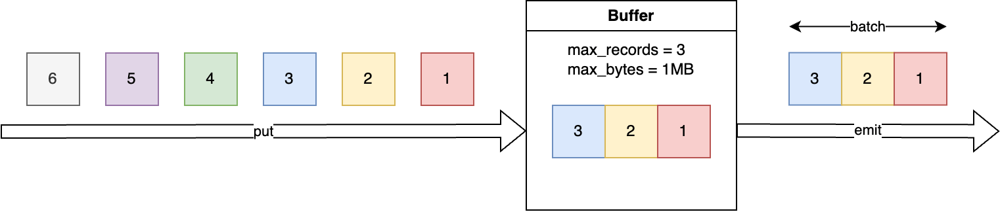
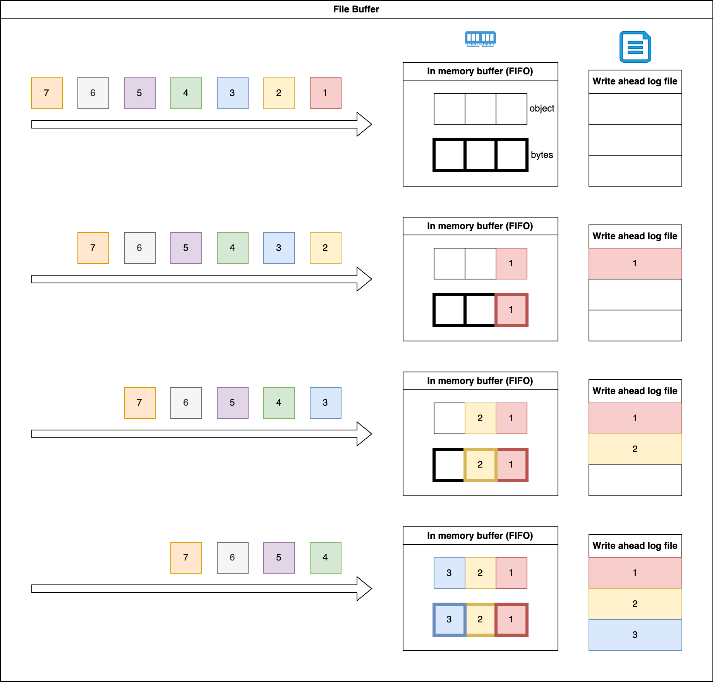
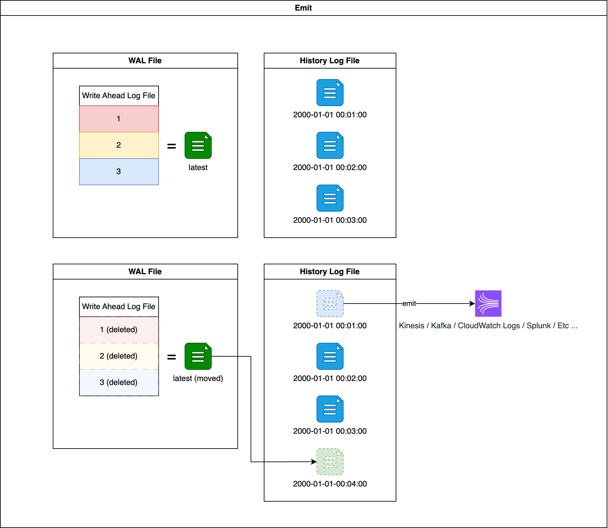

Buffer
==============================================================================

What is Buffer
------------------------------------------------------------------------------
Buffer is a critical component for producer program. Buffer packs your records into a micro batch in order. Once the number of records, the size of the batch or the time since the first record reach certain threshold, the producer will take it and send to target system. For fault tolerance, the buffer will persist the record immediately to an append-only write-ahead-log (WAL) file on disk.

There are many methods for implementing the WAL persistence layer. In general, if you want to minimize the probability of data loss, performance will be lower, latency will be higher, and costs will also increase.

This library provides couple of different buffer implementations, each with different trade-offs. You can choose the one that best fits your use case.

File Buffer
------------------------------------------------------------------------------
This implementation uses local file to store WAL. Everytime the buffer receive a record, it writes the record to the WAL file, and track the number of records and total size in memory. Once the buffer reach certain threshold, it "emit" a batch of records for further processing. However,

Below is the sample usage of :class:`~unistream.buffer.file_buffer.FileBuffer`.

.. dropdown:: file_buffer.py

    .. literalinclude:: ../../../examples/file_buffer.py
       :language: python
       :linenos:

.. dropdown:: file_buffer.py Output

    .. code-block::

        --- push 1th record: {"id": "1", "create_at": "2024-01-07T07:35:21.867031+00:00"}
        ❌ buffer is not full, don't emit
        --- push 2th record: {"id": "2", "create_at": "2024-01-07T07:35:22.872970+00:00"}
        ❌ buffer is not full, don't emit
        --- push 3th record: {"id": "3", "create_at": "2024-01-07T07:35:23.877428+00:00"}
        🚨 buffer program terminated, relaunch
        ✅ buffer is full, emit
        - emit record: {"id": "1", "create_at": "2024-01-07T07:35:21.867031+00:00"}
        - emit record: {"id": "2", "create_at": "2024-01-07T07:35:22.872970+00:00"}
        - emit record: {"id": "3", "create_at": "2024-01-07T07:35:23.877428+00:00"}
        --- push 4th record: {"id": "4", "create_at": "2024-01-07T07:35:24.884330+00:00"}
        ❌ buffer is not full, don't emit
        --- push 5th record: {"id": "5", "create_at": "2024-01-07T07:35:25.887034+00:00"}
        ❌ buffer is not full, don't emit
        --- push 6th record: {"id": "6", "create_at": "2024-01-07T07:35:26.892996+00:00"}
        ✅ buffer is full, emit
        - emit record: {"id": "4", "create_at": "2024-01-07T07:35:24.884330+00:00"}
        - emit record: {"id": "5", "create_at": "2024-01-07T07:35:25.887034+00:00"}
        - emit record: {"id": "6", "create_at": "2024-01-07T07:35:26.892996+00:00"}
        --- push 7th record: {"id": "7", "create_at": "2024-01-07T07:35:27.898541+00:00"}
        ❌ buffer is not full, don't emit
        --- push 8th record: {"id": "8", "create_at": "2024-01-07T07:35:28.902176+00:00"}
        ❌ buffer is not full, don't emit
        --- push 9th record: {"id": "9", "create_at": "2024-01-07T07:35:29.909556+00:00"}
        ✅ buffer is full, emit
        - emit record: {"id": "7", "create_at": "2024-01-07T07:35:27.898541+00:00"}
        - emit record: {"id": "8", "create_at": "2024-01-07T07:35:28.902176+00:00"}
        - emit record: {"id": "9", "create_at": "2024-01-07T07:35:29.909556+00:00"}
        --- push 10th record: {"id": "10", "create_at": "2024-01-07T07:35:30.916696+00:00"}
        🚨 buffer program terminated, relaunch
        ❌ buffer is not full, don't emit
        --- push 11th record: {"id": "11", "create_at": "2024-01-07T07:35:31.921471+00:00"}
        🚨 buffer program terminated, relaunch
        ❌ buffer is not full, don't emit
        --- push 12th record: {"id": "12", "create_at": "2024-01-07T07:35:32.929188+00:00"}
        🚨 buffer program terminated, relaunch
        ✅ buffer is full, emit
        - emit record: {"id": "10", "create_at": "2024-01-07T07:35:30.916696+00:00"}
        - emit record: {"id": "11", "create_at": "2024-01-07T07:35:31.921471+00:00"}
        - emit record: {"id": "12", "create_at": "2024-01-07T07:35:32.929188+00:00"}
        --- push 13th record: {"id": "13", "create_at": "2024-01-07T07:35:33.934699+00:00"}
        🚨 buffer program terminated, relaunch
        ❌ buffer is not full, don't emit
        --- push 14th record: {"id": "14", "create_at": "2024-01-07T07:35:34.941693+00:00"}
        ❌ buffer is not full, don't emit
        --- push 15th record: {"id": "15", "create_at": "2024-01-07T07:35:35.945083+00:00"}
        ✅ buffer is full, emit
        - emit record: {"id": "13", "create_at": "2024-01-07T07:35:33.934699+00:00"}
        - emit record: {"id": "14", "create_at": "2024-01-07T07:35:34.941693+00:00"}
        - emit record: {"id": "15", "create_at": "2024-01-07T07:35:35.945083+00:00"}
