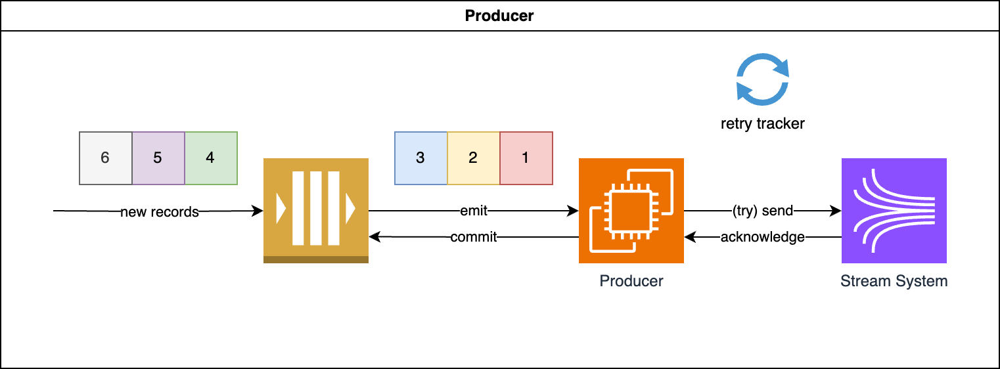
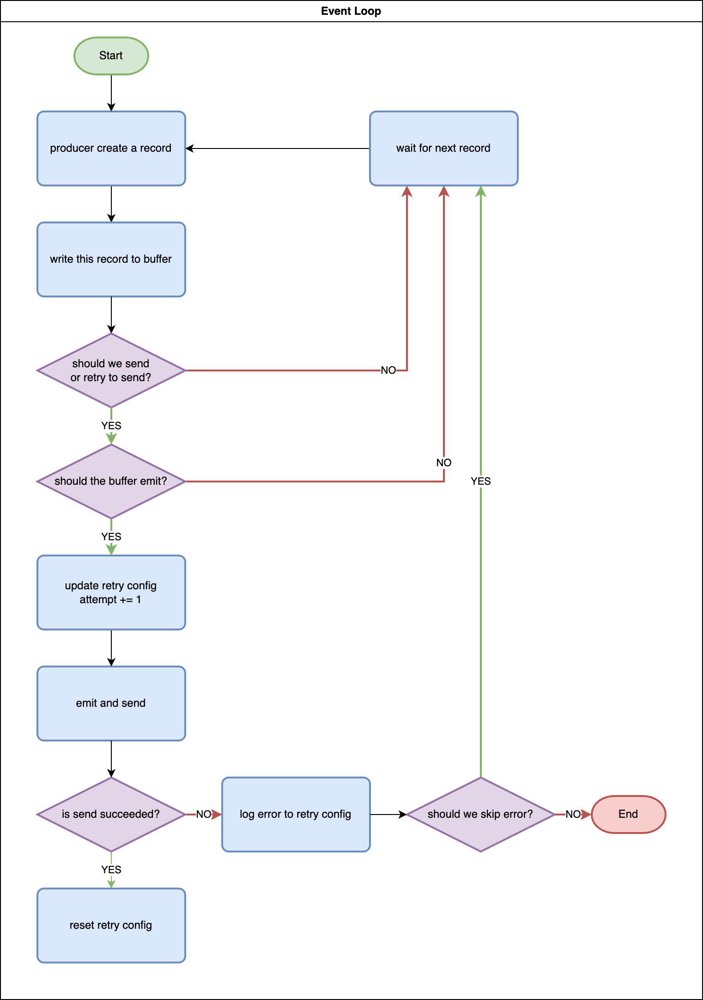
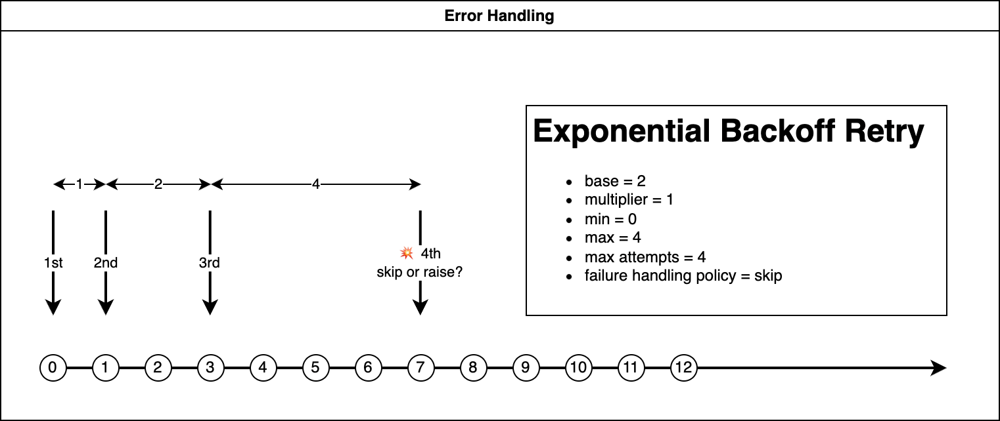

Producer
==============================================================================

What is Producer
------------------------------------------------------------------------------
The Producer is a program that continuously generates records and sends them to a target system. To optimize performance, it utilize a buffer to send data in batches. Regardless of whether it's the producer program or the buffer program that encounters a failure, we must have the capability to restart the program and retry the operation without data loss. This retry process should be executed gracefully, incorporating an exponential backoff strategy. Upon successful completion, we can remove the data from the buffer to save space. This action is referred to as "**commit**".

Who Implements What
------------------------------------------------------------------------------
- ``send()`` and ``new()`` — **Plugin/backend developers** implement these to integrate with a specific streaming backend (e.g. Kinesis ``put_records``, Kafka produce).
- ``put(record)`` — **End users** call this method to send records. Buffer management, retry, and ``send()`` invocation are handled automatically by :class:`~unistream.producer.BaseProducer`.

Error Handling
------------------------------------------------------------------------------
What exponential backoff mean is that, we wait longer and longer between each retry and stop retrying at certain number of failure. The wait internal and max retry count strategy is called a "**Schedule**".

When the max retry count is reached, we have two options:

1. **skip**: persist the context data of this batch for debug or future retry, and skip to the next batch.
2. **raise**: raise error immediately and stop the program.

SimpleProducer Example
------------------------------------------------------------------------------
Below is the sample usage of :class:`~unistream.producers.simple.SimpleProducer`, a simple producer that send data to a target file on your local machine in append-only mode. This producer is for demo and for testing purpose.

.. dropdown:: simple_producer.py

    .. literalinclude:: ../../../examples/simple_producer.py
       :language: python
       :linenos:

.. dropdown:: simple_producer.py Output

    .. code-block::

        +----- ⏱ 📤 Start 'put record' -------------------------------------------------+
        📤
        📤 record = {"id": "1", "create_at": "2024-01-07T07:31:41.482432+00:00"}
        📤 🚫 we should not emit
        📤
        +----- ⏰ ✅ 📤 End 'put record', elapsed = 0.00 sec -----------------------------+
        +----- ⏱ 📤 Start 'put record' -------------------------------------------------+
        📤
        📤 record = {"id": "2", "create_at": "2024-01-07T07:31:42.486702+00:00"}
        📤 🚫 we should not emit
        📤
        +----- ⏰ ✅ 📤 End 'put record', elapsed = 0.00 sec -----------------------------+
        +----- ⏱ 📤 Start 'put record' -------------------------------------------------+
        📤
        📤 record = {"id": "3", "create_at": "2024-01-07T07:31:43.487467+00:00"}
        📤 📤 send records: ['1', '2', '3']
        📤 🔴 failed, error: SendError('randomly failed due to send error')
        📤
        +----- ⏰ ✅ 📤 End 'put record', elapsed = 0.00 sec -----------------------------+
        +----- ⏱ 📤 Start 'put record' -------------------------------------------------+
        📤
        📤 record = {"id": "4", "create_at": "2024-01-07T07:31:44.493604+00:00"}
        📤 📤 send records: ['1', '2', '3']
        📤 🟢 succeeded
        📤
        +----- ⏰ ✅ 📤 End 'put record', elapsed = 0.00 sec -----------------------------+

Vendor-Specific Producers
------------------------------------------------------------------------------
.. note::

    Vendor-specific producers (AWS CloudWatch Logs, AWS Kinesis Stream, Apache Kafka, etc.) are released as separate plugin packages — for example ``unistream-aws-cloudwatch``, ``unistream-aws-kinesis``, ``unistream-kafka``. Refer to those plugins for usage examples and installation instructions.
