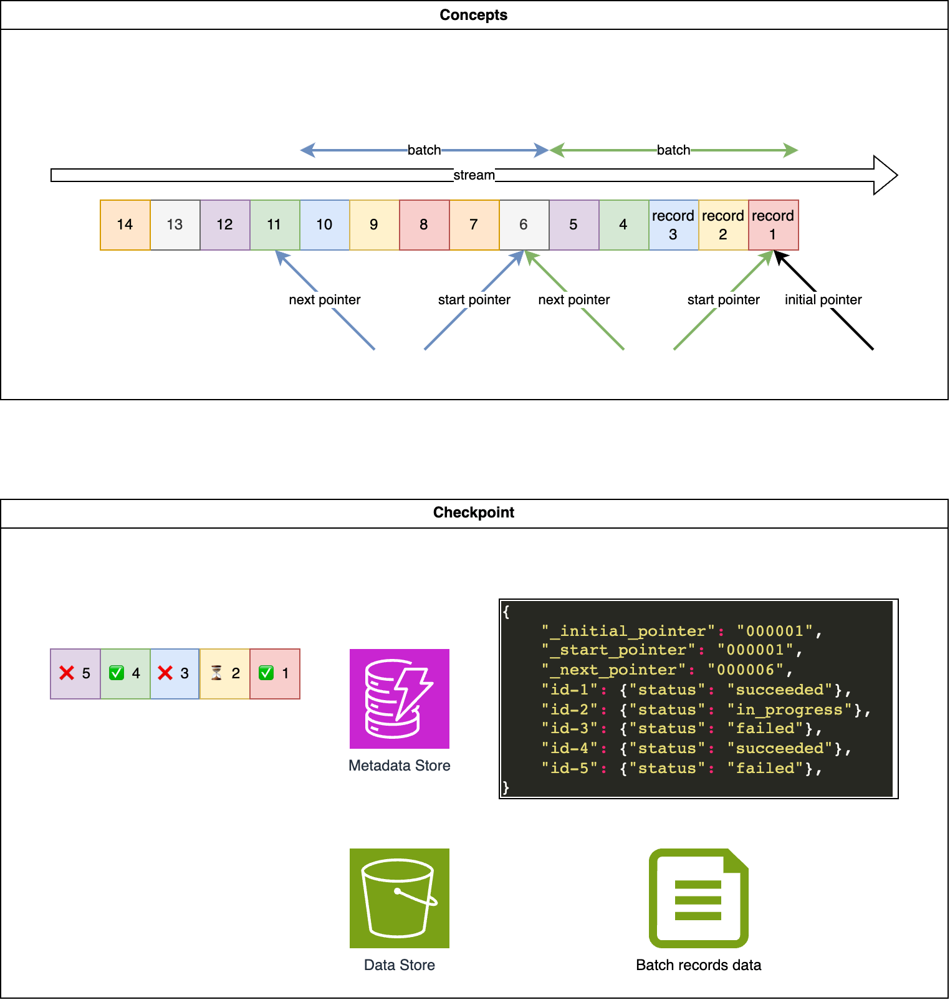

.. _checkpoint:

Checkpoint
==============================================================================

What is Checkpoint
------------------------------------------------------------------------------
For a consumer program, it typically pulls a batch of records to process either in sequence or in parallel. To ensure 'Exact-once-consumption' we need a mechanism for tracking the processing status, which includes states such as 'pending', 'in-progress', 'failed', 'exhausted' (failed too many times), or 'succeeded'. Additionally, the start pointer for this batch may expire, and the records' data may become inaccessible if the consumer program fails. Therefore, we need a persistent layer to store the records data as well.

Checkpoint serves as a component that provides the functionalities mentioned above. Typically, status data, also considered as metadata, is small and should be stored in a high-performance database like AWS DynamoDB or Redis. On the other hand, considering that the records data can be quite substantial, AWS S3 becomes a preferable choice.

In this project, we offer a base class, :class:`~unistream.consumer.CheckPoint`, which implements the core logic of checkpointing but intentionally leaves the backend read/write logic unimplemented. This design allows you to extend the class to use any backend of your choice."

Simple Checkpoint
------------------------------------------------------------------------------
:class:`~unistream.checkpoints.simple.SimpleCheckpoint` is a simple implementation of a ``CheckPoint``, it uses local files to store the checkpoint data. It is not recommended to use this class in production, but it can be used for demonstration and testing purposes.

DynamoDB S3 Checkpoint
------------------------------------------------------------------------------
Amazon DynamoDB is a serverless, infinitely scalable, and high-performance key value database provided by AWS, which could be a perfect place to store status tracking metadata. Amazon S3 is a highly available and durable storage service provided by AWS, which could be a perfect place to store the records data.

:class:`~unistream.checkpoints.dynamodb_s3.DynamoDBS3CheckPoint` is a implementation of a ``CheckPoint`` based on DynamoDB and S3.
