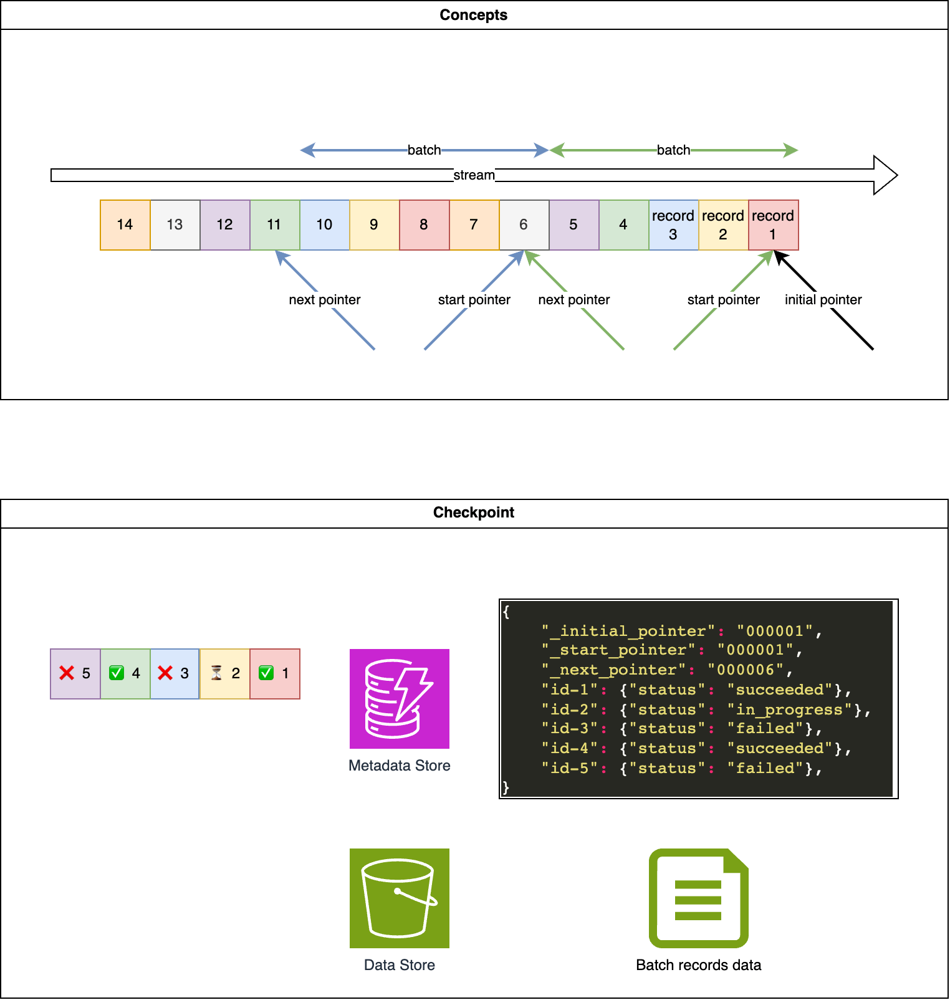

.. _checkpoint:

Checkpoint
==============================================================================

What is Checkpoint
------------------------------------------------------------------------------
For a consumer program, it typically pulls a batch of records to process either in sequence or in parallel. To ensure 'Exact-once-consumption' we need a mechanism for tracking the processing status, which includes states such as 'pending', 'in-progress', 'failed', 'exhausted' (failed too many times), or 'succeeded'. Additionally, the start pointer for this batch may expire, and the records' data may become inaccessible if the consumer program fails. Therefore, we need a persistent layer to store the records data as well.

Checkpoint serves as a component that provides the functionalities mentioned above. Typically, status data, also considered as metadata, is small and should be stored in a high-performance database like AWS DynamoDB or Redis. On the other hand, considering that the records data can be quite substantial, AWS S3 becomes a preferable choice.

In this project, we offer a base class, :class:`~unistream.checkpoint.BaseCheckPoint`, which implements the core logic of checkpointing but intentionally leaves the backend read/write logic unimplemented. This design allows you to extend the class to use any backend of your choice.

Who Implements What
------------------------------------------------------------------------------
- ``dump``, ``load``, ``dump_records``, ``load_records``, ``dump_as_*`` — **Plugin/backend developers** implement these to provide persistence for a specific backend (e.g. DynamoDB + S3, local JSON files).
- ``mark_as_*``, ``is_ready_for_next_batch``, ``update_for_new_batch`` — **Framework internal**, already implemented in :class:`~unistream.checkpoint.BaseCheckPoint`. Called automatically by the consumer loop.
- ``get_tracker``, ``get_not_succeeded_records`` — **End users** may call these for inspection or DLQ handling.

Simple Checkpoint
------------------------------------------------------------------------------
:class:`~unistream.checkpoints.simple.SimpleCheckpoint` is a simple implementation of a ``CheckPoint``, it uses local files to store the checkpoint data. It is not recommended to use this class in production, but it can be used for demonstration and testing purposes.

Vendor-Specific Checkpoints
------------------------------------------------------------------------------
.. note::

    Production-grade checkpoint backends (DynamoDB + S3, Redis, PostgreSQL, etc.) are released as separate plugin packages — for example ``unistream-aws-dynamodb``. Refer to those plugins for installation and usage.
