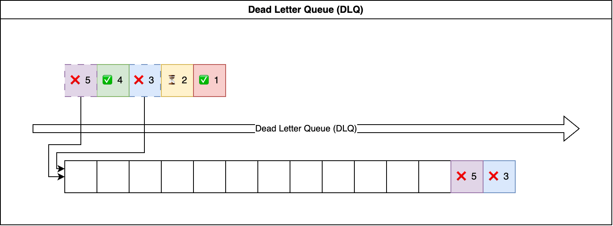

Consumer
==============================================================================

What is Consumer
------------------------------------------------------------------------------
The Consumer is a program that continuously pulls records from a stream system and processes the data, either sequentially or in parallel. Typically, we require a 'pointer' that tells the consumer where to start pulling the data. In Kafka, it is referred to as an 'offset'; in AWS Kinesis Stream, it is known as a 'shard iterator'; and in Pulsar, it is called a 'message id'.

In the previous document, we introduced the concept of :ref:`checkpoint`. A consumer program essentially leverages the checkpoint, updating the processing status before and after executing processing logic, and handling errors appropriately. It also persists the checkpoint data to the storage backend every time it changes."

What is Dead-Letter-Queue (DLQ)
------------------------------------------------------------------------------
Some records may still fail after multiple retries. Typically, we aim to ensure smooth data processing without blocking it. In business-critical applications, it's common practice to route failed data to a dedicated location, often a message queue or another stream system. This allows for debugging and later reprocessing.

In certain use cases, it's critical to process records strictly in order. If a preceding processing attempt fails, we must stop from processing subsequent records. In such scenarios, we should halt processing and trigger a notification for immediate investigation. In any case, a Dead-Letter Queue (DLQ) serves as an additional fault-tolerant layer for business-critical use cases.

Simple Consumer Example
------------------------------------------------------------------------------
Below is the sample usage of :class:`~unistream.consumers.simple.SimpleConsumer`, a simple consumer that read data from the output of :class:`~unistream.producers.simple.SimpleProducer`.

.. dropdown:: aws_kinesis_consumer.py Output

    .. literalinclude:: ../../../examples/aws_kinesis_consumer.py
       :language: python
       :linenos:

.. dropdown:: aws_kinesis_consumer.py Output

    .. code-block::

        --- 1 th pull ---
        +----- ⏱ ⏳ Start 'process batch' ----------------------------------------------+
        ⏳
        ⏳
        +----- ⏰ ✅ ⏳ End 'process batch', elapsed = 0.03 sec --------------------------+
        --- 2 th pull ---
        +----- ⏱ ⏳ Start 'process batch' ----------------------------------------------+
        ⏳
        ⏳
        +----- ⏰ ✅ ⏳ End 'process batch', elapsed = 0.03 sec --------------------------+
        --- 3 th pull ---
        +----- ⏱ ⏳ Start 'process batch' ----------------------------------------------+
        ⏳
        ⏳
        +----- ⏰ ✅ ⏳ End 'process batch', elapsed = 0.03 sec --------------------------+
        --- 4 th pull ---
        +----- ⏱ ⏳ Start 'process batch' ----------------------------------------------+
        ⏳
        ⏳
        +----- ⏰ ✅ ⏳ End 'process batch', elapsed = 0.06 sec --------------------------+
        --- 5 th pull ---
        +----- ⏱ ⏳ Start 'process batch' ----------------------------------------------+
        ⏳
        ⏳
        +----- ⏰ ✅ ⏳ End 'process batch', elapsed = 0.03 sec --------------------------+
        --- 6 th pull ---
        +----- ⏱ ⏳ Start 'process batch' ----------------------------------------------+
        ⏳
        ❌ {"id": "1", "create_at": "2024-01-09T06:24:06.759449+00:00", "value": 72}
        ✅ {"id": "1", "create_at": "2024-01-09T06:24:06.759449+00:00", "value": 72}
        ❌ {"id": "2", "create_at": "2024-01-09T06:24:07.764857+00:00", "value": 16}
        ❌ {"id": "2", "create_at": "2024-01-09T06:24:07.764857+00:00", "value": 16}
        ✅ {"id": "2", "create_at": "2024-01-09T06:24:07.764857+00:00", "value": 16}
        ✅ {"id": "3", "create_at": "2024-01-09T06:24:08.770662+00:00", "value": 35}
        ⏳
        +----- ⏰ ✅ ⏳ End 'process batch', elapsed = 3.05 sec --------------------------+
        --- 7 th pull ---
        +----- ⏱ ⏳ Start 'process batch' ----------------------------------------------+
        ⏳
        ❌ {"id": "4", "create_at": "2024-01-09T06:24:09.775362+00:00", "value": 89}
        ✅ {"id": "4", "create_at": "2024-01-09T06:24:09.775362+00:00", "value": 89}
        ❌ {"id": "5", "create_at": "2024-01-09T06:24:10.991460+00:00", "value": 7}
        ❌ {"id": "5", "create_at": "2024-01-09T06:24:10.991460+00:00", "value": 7}
        ✅ {"id": "5", "create_at": "2024-01-09T06:24:10.991460+00:00", "value": 7}
        ✅ {"id": "6", "create_at": "2024-01-09T06:24:11.994688+00:00", "value": 49}
        ⏳
        +----- ⏰ ✅ ⏳ End 'process batch', elapsed = 3.04 sec --------------------------+
        --- 8 th pull ---
        +----- ⏱ ⏳ Start 'process batch' ----------------------------------------------+
        ⏳
        ✅ {"id": "7", "create_at": "2024-01-09T06:24:13.025437+00:00", "value": 70}
        ✅ {"id": "8", "create_at": "2024-01-09T06:24:14.031405+00:00", "value": 32}
        ✅ {"id": "9", "create_at": "2024-01-09T06:24:15.036961+00:00", "value": 45}
        ⏳
        +----- ⏰ ✅ ⏳ End 'process batch', elapsed = 0.03 sec --------------------------+
        --- 9 th pull ---
        +----- ⏱ ⏳ Start 'process batch' ----------------------------------------------+
        ⏳
        ✅ {"id": "10", "create_at": "2024-01-09T06:24:16.043874+00:00", "value": 40}
        ❌ {"id": "11", "create_at": "2024-01-09T06:24:17.084737+00:00", "value": 6}
        ✅ {"id": "11", "create_at": "2024-01-09T06:24:17.084737+00:00", "value": 6}
        ❌ {"id": "12", "create_at": "2024-01-09T06:24:18.091867+00:00", "value": 87}
        ❌ {"id": "12", "create_at": "2024-01-09T06:24:18.091867+00:00", "value": 87}
        ✅ {"id": "12", "create_at": "2024-01-09T06:24:18.091867+00:00", "value": 87}
        ⏳
        +----- ⏰ ✅ ⏳ End 'process batch', elapsed = 3.07 sec --------------------------+
        --- 10 th pull ---
        +----- ⏱ ⏳ Start 'process batch' ----------------------------------------------+
        ⏳
        ❌ {"id": "13", "create_at": "2024-01-09T06:24:19.100240+00:00", "value": 26}
        ❌ {"id": "13", "create_at": "2024-01-09T06:24:19.100240+00:00", "value": 26}
        ❌ {"id": "13", "create_at": "2024-01-09T06:24:19.100240+00:00", "value": 26}
        ✅ {"id": "13", "create_at": "2024-01-09T06:24:19.100240+00:00", "value": 26}
        ✅ {"id": "14", "create_at": "2024-01-09T06:24:20.138912+00:00", "value": 7}
        ❌ {"id": "15", "create_at": "2024-01-09T06:24:21.144013+00:00", "value": 55}
        ✅ {"id": "15", "create_at": "2024-01-09T06:24:21.144013+00:00", "value": 55}
        ⏳
        +----- ⏰ ✅ ⏳ End 'process batch', elapsed = 4.15 sec --------------------------+
        --- 11 th pull ---
        +----- ⏱ ⏳ Start 'process batch' ----------------------------------------------+
        ⏳
        ❌ {"id": "16", "create_at": "2024-01-09T06:24:22.204526+00:00", "value": 57}
        ✅ {"id": "16", "create_at": "2024-01-09T06:24:22.204526+00:00", "value": 57}
        ❌ {"id": "17", "create_at": "2024-01-09T06:24:23.211185+00:00", "value": 31}
        ❌ {"id": "17", "create_at": "2024-01-09T06:24:23.211185+00:00", "value": 31}
        ❌ {"id": "17", "create_at": "2024-01-09T06:24:23.211185+00:00", "value": 31}
        ❌ {"id": "17", "create_at": "2024-01-09T06:24:23.211185+00:00", "value": 31}
        ✅ DLQ: {"id": "17", "create_at": "2024-01-09T06:24:23.211185+00:00", "value": 31}
        ✅ {"id": "18", "create_at": "2024-01-09T06:24:24.218099+00:00", "value": 92}
        ⏳
        +----- ⏰ ✅ ⏳ End 'process batch', elapsed = 4.06 sec --------------------------+

AWS Kinesis Producer Consumer Example
------------------------------------------------------------------------------
This example demonstrates how to produce and consume message from AWS Kinesis Data Stream.

For producer, it has:

- buffer and send records in batch
- persist the buffered records
- exponential backoff retry
- recovery from last failure

For Consumer, it has:

- automatic retry using exponential backoff
- persist the checkpoint after succeed
- recovery from last success
- send failed records to dead letter queue

.. note::

    this consumer use a local file to store checkpoint and use a local file as a DLQ.
    this is for POC only, in production, you should use a DynamoDB + S3 for checkpoint,
    and use AWS SQS or another AWS Kinesis Stream for DLQ.

.. dropdown:: aws_kinesis_consumer.py

    .. literalinclude:: ../../../examples/aws_kinesis_consumer.py
       :language: python
       :linenos:

.. dropdown:: aws_kinesis_producer.py

    .. literalinclude:: ../../../examples/aws_kinesis_producer.py
       :language: python
       :linenos:

.. dropdown:: aws_kinesis_consumer.py Output

    .. code-block::

        --- 1 th pull ---
        +----- ⏱ ⏳ Start 'process batch' ----------------------------------------------+
        ⏳
        ⏳
        +----- ⏰ ✅ ⏳ End 'process batch', elapsed = 0.03 sec --------------------------+
        --- 2 th pull ---
        +----- ⏱ ⏳ Start 'process batch' ----------------------------------------------+
        ⏳
        ⏳
        +----- ⏰ ✅ ⏳ End 'process batch', elapsed = 0.03 sec --------------------------+
        --- 3 th pull ---
        +----- ⏱ ⏳ Start 'process batch' ----------------------------------------------+
        ⏳
        ⏳
        +----- ⏰ ✅ ⏳ End 'process batch', elapsed = 0.04 sec --------------------------+
        --- 4 th pull ---
        +----- ⏱ ⏳ Start 'process batch' ----------------------------------------------+
        ⏳
        ⏳
        +----- ⏰ ✅ ⏳ End 'process batch', elapsed = 0.03 sec --------------------------+
        --- 5 th pull ---
        +----- ⏱ ⏳ Start 'process batch' ----------------------------------------------+
        ⏳
        ✅ {"id": "1", "create_at": "2024-01-09T05:50:53.158510+00:00", "value": 26}
        ❌ {"id": "2", "create_at": "2024-01-09T05:50:54.164330+00:00", "value": 87}
        ❌ {"id": "2", "create_at": "2024-01-09T05:50:54.164330+00:00", "value": 87}
        ✅ {"id": "2", "create_at": "2024-01-09T05:50:54.164330+00:00", "value": 87}
        ✅ {"id": "3", "create_at": "2024-01-09T05:50:55.171156+00:00", "value": 29}
        ⏳
        +----- ⏰ ✅ ⏳ End 'process batch', elapsed = 2.05 sec --------------------------+
        --- 6 th pull ---
        +----- ⏱ ⏳ Start 'process batch' ----------------------------------------------+
        ⏳
        ✅ {"id": "4", "create_at": "2024-01-09T05:50:56.342718+00:00", "value": 26}
        ✅ {"id": "5", "create_at": "2024-01-09T05:50:57.348946+00:00", "value": 62}
        ✅ {"id": "6", "create_at": "2024-01-09T05:50:58.353603+00:00", "value": 38}
        ⏳
        +----- ⏰ ✅ ⏳ End 'process batch', elapsed = 0.04 sec --------------------------+
        --- 7 th pull ---
        +----- ⏱ ⏳ Start 'process batch' ----------------------------------------------+
        ⏳
        ⏳
        +----- ⏰ ✅ ⏳ End 'process batch', elapsed = 0.03 sec --------------------------+
        --- 8 th pull ---
        +----- ⏱ ⏳ Start 'process batch' ----------------------------------------------+
        ⏳
        ⏳
        +----- ⏰ ✅ ⏳ End 'process batch', elapsed = 0.03 sec --------------------------+
        --- 9 th pull ---
        +----- ⏱ ⏳ Start 'process batch' ----------------------------------------------+
        ⏳
        ✅ {"id": "7", "create_at": "2024-01-09T05:50:59.383881+00:00", "value": 79}
        ✅ {"id": "8", "create_at": "2024-01-09T05:51:00.390543+00:00", "value": 23}
        ✅ {"id": "9", "create_at": "2024-01-09T05:51:01.396514+00:00", "value": 61}
        ⏳
        +----- ⏰ ✅ ⏳ End 'process batch', elapsed = 0.03 sec --------------------------+
        --- 10 th pull ---
        +----- ⏱ ⏳ Start 'process batch' ----------------------------------------------+
        ⏳
        ⏳
        +----- ⏰ ✅ ⏳ End 'process batch', elapsed = 0.02 sec --------------------------+
        --- 11 th pull ---
        +----- ⏱ ⏳ Start 'process batch' ----------------------------------------------+
        ⏳
        ⏳
        +----- ⏰ ✅ ⏳ End 'process batch', elapsed = 0.03 sec --------------------------+
        --- 12 th pull ---
        +----- ⏱ ⏳ Start 'process batch' ----------------------------------------------+
        ⏳
        ❌ {"id": "10", "create_at": "2024-01-09T05:51:02.421727+00:00", "value": 46}
        ✅ {"id": "10", "create_at": "2024-01-09T05:51:02.421727+00:00", "value": 46}
        ❌ {"id": "11", "create_at": "2024-01-09T05:51:03.427567+00:00", "value": 33}
        ✅ {"id": "11", "create_at": "2024-01-09T05:51:03.427567+00:00", "value": 33}
        ✅ {"id": "12", "create_at": "2024-01-09T05:51:04.433538+00:00", "value": 23}
        ⏳
        +----- ⏰ ✅ ⏳ End 'process batch', elapsed = 2.06 sec --------------------------+
        --- 13 th pull ---
        +----- ⏱ ⏳ Start 'process batch' ----------------------------------------------+
        ⏳
        ❌ {"id": "13", "create_at": "2024-01-09T05:51:05.472854+00:00", "value": 55}
        ❌ {"id": "13", "create_at": "2024-01-09T05:51:05.472854+00:00", "value": 55}
        ❌ {"id": "13", "create_at": "2024-01-09T05:51:05.472854+00:00", "value": 55}
        ❌ {"id": "13", "create_at": "2024-01-09T05:51:05.472854+00:00", "value": 55}
        ✅ DLQ: {"id": "13", "create_at": "2024-01-09T05:51:05.472854+00:00", "value": 55}
        ❌ {"id": "14", "create_at": "2024-01-09T05:51:06.477555+00:00", "value": 1}
        ❌ {"id": "14", "create_at": "2024-01-09T05:51:06.477555+00:00", "value": 1}
        ❌ {"id": "14", "create_at": "2024-01-09T05:51:06.477555+00:00", "value": 1}
        ✅ {"id": "14", "create_at": "2024-01-09T05:51:06.477555+00:00", "value": 1}
        ❌ {"id": "15", "create_at": "2024-01-09T05:51:07.484951+00:00", "value": 51}
        ✅ {"id": "15", "create_at": "2024-01-09T05:51:07.484951+00:00", "value": 51}
        ⏳
        +----- ⏰ ✅ ⏳ End 'process batch', elapsed = 7.09 sec --------------------------+
        --- 14 th pull ---
        +----- ⏱ ⏳ Start 'process batch' ----------------------------------------------+
        ⏳
        ✅ {"id": "16", "create_at": "2024-01-09T05:51:08.523287+00:00", "value": 11}
        ✅ {"id": "17", "create_at": "2024-01-09T05:51:09.529575+00:00", "value": 72}
        ❌ {"id": "18", "create_at": "2024-01-09T05:51:10.537244+00:00", "value": 46}
        ❌ {"id": "18", "create_at": "2024-01-09T05:51:10.537244+00:00", "value": 46}
        ❌ {"id": "18", "create_at": "2024-01-09T05:51:10.537244+00:00", "value": 46}
        ✅ {"id": "18", "create_at": "2024-01-09T05:51:10.537244+00:00", "value": 46}
        ⏳
        +----- ⏰ ✅ ⏳ End 'process batch', elapsed = 3.18 sec --------------------------+

.. dropdown:: aws_kinesis_producer.py Output

    .. code-block::

        +----- ⏱ 📤 Start 'put record' -------------------------------------------------+
        📤
        📤 record = {"id": "1", "create_at": "2024-01-09T05:52:44.322991+00:00", "value": 43}
        📤 🚫 we should not emit
        📤
        +----- ⏰ ✅ 📤 End 'put record', elapsed = 0.00 sec -----------------------------+
        +----- ⏱ 📤 Start 'put record' -------------------------------------------------+
        📤
        📤 record = {"id": "2", "create_at": "2024-01-09T05:52:45.325225+00:00", "value": 84}
        📤 🚫 we should not emit
        📤
        +----- ⏰ ✅ 📤 End 'put record', elapsed = 0.00 sec -----------------------------+
        +----- ⏱ 📤 Start 'put record' -------------------------------------------------+
        📤
        📤 record = {"id": "3", "create_at": "2024-01-09T05:52:46.328910+00:00", "value": 88}
        📤 📤 send records: ['1', '2', '3']
        📤 🟢 succeeded
        📤
        +----- ⏰ ✅ 📤 End 'put record', elapsed = 0.17 sec -----------------------------+
        +----- ⏱ 📤 Start 'put record' -------------------------------------------------+
        📤
        📤 record = {"id": "4", "create_at": "2024-01-09T05:52:47.507636+00:00", "value": 48}
        📤 🚫 we should not emit
        📤
        +----- ⏰ ✅ 📤 End 'put record', elapsed = 0.00 sec -----------------------------+
        +----- ⏱ 📤 Start 'put record' -------------------------------------------------+
        📤
        📤 record = {"id": "5", "create_at": "2024-01-09T05:52:48.514062+00:00", "value": 58}
        📤 🚫 we should not emit
        📤
        +----- ⏰ ✅ 📤 End 'put record', elapsed = 0.00 sec -----------------------------+
        +----- ⏱ 📤 Start 'put record' -------------------------------------------------+
        📤
        📤 record = {"id": "6", "create_at": "2024-01-09T05:52:49.520373+00:00", "value": 60}
        📤 📤 send records: ['4', '5', '6']
        📤 🔴 failed, error: SendError('randomly failed due to send error')
        📤
        +----- ⏰ ✅ 📤 End 'put record', elapsed = 0.00 sec -----------------------------+
        +----- ⏱ 📤 Start 'put record' -------------------------------------------------+
        📤
        📤 record = {"id": "7", "create_at": "2024-01-09T05:52:50.525767+00:00", "value": 29}
        📤 📤 send records: ['4', '5', '6']
        📤 🔴 failed, error: SendError('randomly failed due to send error')
        📤
        +----- ⏰ ✅ 📤 End 'put record', elapsed = 0.00 sec -----------------------------+
        +----- ⏱ 📤 Start 'put record' -------------------------------------------------+
        📤
        📤 record = {"id": "8", "create_at": "2024-01-09T05:52:51.532027+00:00", "value": 73}
        📤 🚫 on hold due to exponential backoff
        📤
        +----- ⏰ ✅ 📤 End 'put record', elapsed = 0.00 sec -----------------------------+
        +----- ⏱ 📤 Start 'put record' -------------------------------------------------+
        📤
        📤 record = {"id": "9", "create_at": "2024-01-09T05:52:52.539793+00:00", "value": 100}
        📤 📤 send records: ['4', '5', '6']
        📤 🔴 failed, error: SendError('randomly failed due to send error')
        📤
        +----- ⏰ ✅ 📤 End 'put record', elapsed = 0.00 sec -----------------------------+
        +----- ⏱ 📤 Start 'put record' -------------------------------------------------+
        📤
        📤 record = {"id": "10", "create_at": "2024-01-09T05:52:53.548661+00:00", "value": 31}
        📤 🚫 on hold due to exponential backoff
        📤
        +----- ⏰ ✅ 📤 End 'put record', elapsed = 0.00 sec -----------------------------+
        +----- ⏱ 📤 Start 'put record' -------------------------------------------------+
        📤
        📤 record = {"id": "11", "create_at": "2024-01-09T05:52:54.555044+00:00", "value": 65}
        📤 🚫 on hold due to exponential backoff
        📤
        +----- ⏰ ✅ 📤 End 'put record', elapsed = 0.00 sec -----------------------------+
        +----- ⏱ 📤 Start 'put record' -------------------------------------------------+
        📤
        📤 record = {"id": "12", "create_at": "2024-01-09T05:52:55.561778+00:00", "value": 34}
        📤 🚫 on hold due to exponential backoff
        📤
        +----- ⏰ ✅ 📤 End 'put record', elapsed = 0.00 sec -----------------------------+
        +----- ⏱ 📤 Start 'put record' -------------------------------------------------+
        📤
        📤 record = {"id": "13", "create_at": "2024-01-09T05:52:56.570101+00:00", "value": 44}
        📤 📤 send records: ['4', '5', '6']
        📤 🟢 succeeded
        📤
        +----- ⏰ ✅ 📤 End 'put record', elapsed = 0.11 sec -----------------------------+
        +----- ⏱ 📤 Start 'put record' -------------------------------------------------+
        📤
        📤 record = {"id": "14", "create_at": "2024-01-09T05:52:57.688880+00:00", "value": 32}
        📤 📤 send records: ['7', '8', '9']
        📤 🟢 succeeded
        📤
        +----- ⏰ ✅ 📤 End 'put record', elapsed = 0.04 sec -----------------------------+
        +----- ⏱ 📤 Start 'put record' -------------------------------------------------+
        📤
        📤 record = {"id": "15", "create_at": "2024-01-09T05:52:58.727742+00:00", "value": 71}
        📤 📤 send records: ['10', '11', '12']
        📤 🔴 failed, error: SendError('randomly failed due to send error')
        📤
        +----- ⏰ ✅ 📤 End 'put record', elapsed = 0.00 sec -----------------------------+
        +----- ⏱ 📤 Start 'put record' -------------------------------------------------+
        📤
        📤 record = {"id": "16", "create_at": "2024-01-09T05:52:59.731922+00:00", "value": 22}
        📤 📤 send records: ['10', '11', '12']
        📤 🟢 succeeded
        📤
        +----- ⏰ ✅ 📤 End 'put record', elapsed = 0.03 sec -----------------------------+
        +----- ⏱ 📤 Start 'put record' -------------------------------------------------+
        📤
        📤 record = {"id": "17", "create_at": "2024-01-09T05:53:00.765578+00:00", "value": 5}
        📤 📤 send records: ['13', '14', '15']
        📤 🔴 failed, error: SendError('randomly failed due to send error')
        📤
        +----- ⏰ ✅ 📤 End 'put record', elapsed = 0.00 sec -----------------------------+
        +----- ⏱ 📤 Start 'put record' -------------------------------------------------+
        📤
        📤 record = {"id": "18", "create_at": "2024-01-09T05:53:01.770917+00:00", "value": 44}
        📤 📤 send records: ['13', '14', '15']
        📤 🟢 succeeded
        📤
        +----- ⏰ ✅ 📤 End 'put record', elapsed = 0.03 sec -----------------------------+
        +----- ⏱ 📤 Start 'put record' -------------------------------------------------+
        📤
        📤 record = {"id": "19", "create_at": "2024-01-09T05:53:02.801051+00:00", "value": 8}
        📤 📤 send records: ['16', '17', '18']
        📤 🟢 succeeded
        📤
        +----- ⏰ ✅ 📤 End 'put record', elapsed = 0.04 sec -----------------------------+
        +----- ⏱ 📤 Start 'put record' -------------------------------------------------+
        📤
        📤 record = {"id": "20", "create_at": "2024-01-09T05:53:03.841379+00:00", "value": 86}
        📤 🚫 we should not emit
        📤
        +----- ⏰ ✅ 📤 End 'put record', elapsed = 0.00 sec -----------------------------+
        +----- ⏱ 📤 Start 'put record' -------------------------------------------------+
        📤
        📤 record = {"id": "21", "create_at": "2024-01-09T05:53:04.847012+00:00", "value": 49}
        📤 📤 send records: ['19', '20', '21']
        📤 🟢 succeeded
        📤
        +----- ⏰ ✅ 📤 End 'put record', elapsed = 0.04 sec -----------------------------+
