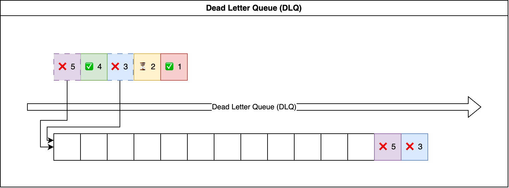

Consumer
==============================================================================

What is Consumer
------------------------------------------------------------------------------
The Consumer is a program that continuously pulls records from a stream system and processes the data, either sequentially or in parallel. Typically, we require a 'pointer' that tells the consumer where to start pulling the data. In Kafka, it is referred to as an 'offset'; in AWS Kinesis Stream, it is known as a 'shard iterator'; and in Pulsar, it is called a 'message id'.

In the previous document, we introduced the concept of :ref:`checkpoint`. A consumer program essentially leverages the checkpoint, updating the processing status before and after executing processing logic, and handling errors appropriately. It also persists the checkpoint data to the storage backend every time it changes.

Who Implements What
------------------------------------------------------------------------------
- ``get_records()`` and ``new()`` — **Plugin/backend developers** implement these to pull records from a specific streaming backend (e.g. Kinesis ``get_records``, Kafka poll).
- ``process_record(record)`` — **End users** must implement this with their business logic. Raise an exception to indicate failure; the framework handles retries automatically.
- ``process_failed_record(record)`` — **End users** may override this to send failed records to a DLQ. Default is no-op.
- ``process_batch()``, ``run()`` — **End users** call these to start consuming. Already implemented in :class:`~unistream.consumer.BaseConsumer`.

What is Dead-Letter-Queue (DLQ)
------------------------------------------------------------------------------
Some records may still fail after multiple retries. Typically, we aim to ensure smooth data processing without blocking it. In business-critical applications, it's common practice to route failed data to a dedicated location, often a message queue or another stream system. This allows for debugging and later reprocessing.

In certain use cases, it's critical to process records strictly in order. If a preceding processing attempt fails, we must stop from processing subsequent records. In such scenarios, we should halt processing and trigger a notification for immediate investigation. In any case, a Dead-Letter Queue (DLQ) serves as an additional fault-tolerant layer for business-critical use cases.

Simple Consumer Example
------------------------------------------------------------------------------
Below is the sample usage of :class:`~unistream.consumers.simple.SimpleConsumer`, a simple consumer that read data from the output of :class:`~unistream.producers.simple.SimpleProducer`.

.. dropdown:: simple_consumer.py

    .. literalinclude:: ../../../examples/simple_consumer.py
       :language: python
       :linenos:

Vendor-Specific Consumers
------------------------------------------------------------------------------
.. note::

    Vendor-specific consumers (AWS Kinesis Stream, Apache Kafka, etc.) are released as separate plugin packages — for example ``unistream-aws-kinesis``, ``unistream-kafka``. Each plugin ships its own concrete ``Consumer`` and (when relevant) DLQ variants. Refer to those plugins for installation and usage examples.
